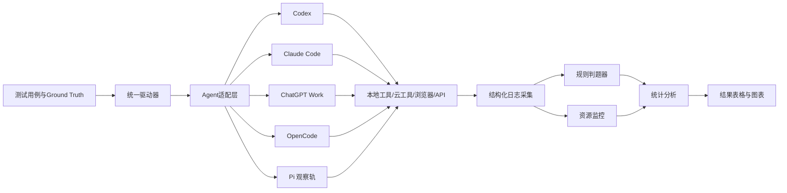
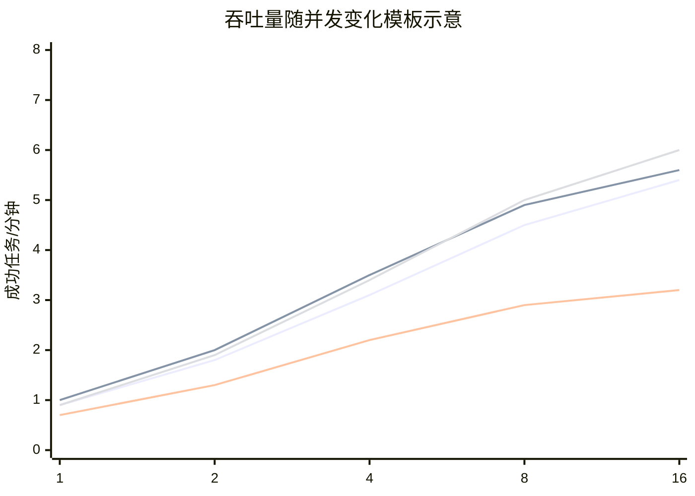
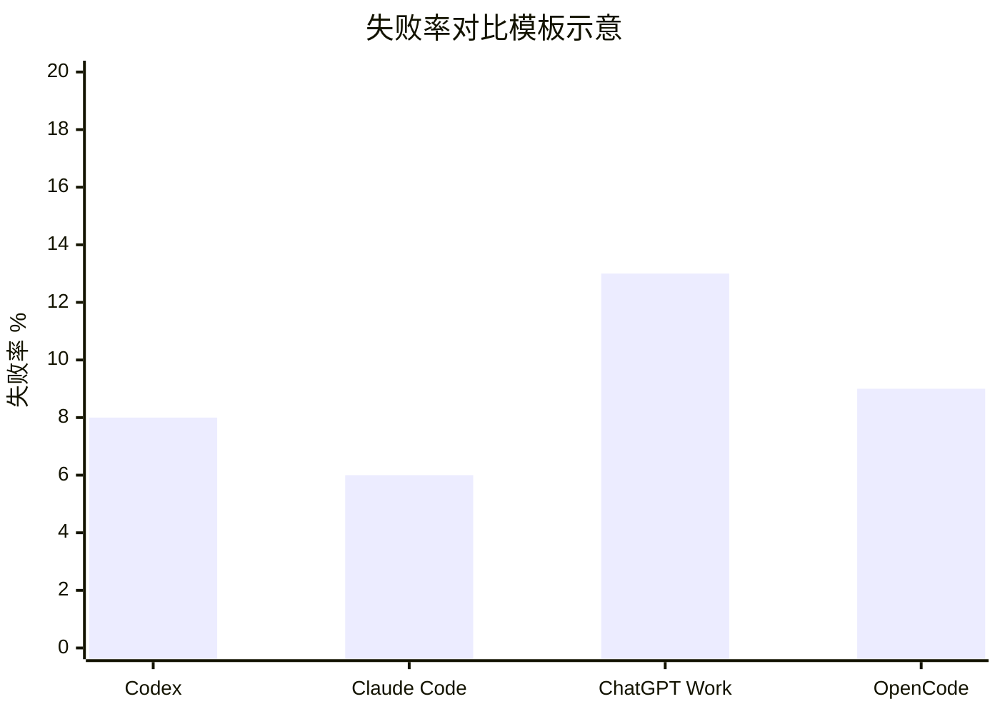
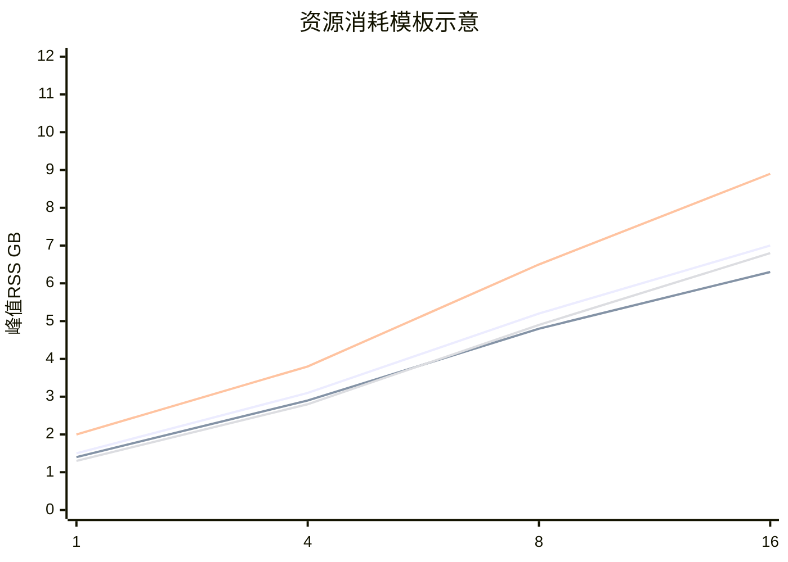

# 面向在研 Agent 的底层 Tool 方案研究报告

## 执行摘要

这份报告的核心结论是：如果你的目标是为“代码/本地文件/网页/API/浏览器自动化”这类长链路 Agent 选择底层热点 tool 方案，真正需要比较的不是“模型名字”本身，而是**Agent 外壳、工具运行时、权限/审批机制、上下文管理方式，以及底层模型**这五层的组合。公开官方资料显示，**Claude Code** 与 **OpenCode** 在“低层工具显式暴露”上最强，明确提供了 `Read/Write/Edit/Bash/Glob/Grep/WebSearch/WebFetch` 等一组贴近工程实践的原语；**Codex** 当前则更强调“本地仓库 + sandbox + approvals + skills + subagents”的工作流控制，公开文档对低层原语的描述没有 Claude Code / OpenCode 那么颗粒化，但它对本地读写、命令执行、网络审批和并行子代理的支持已经足以构成完整 coding-agent runtime；**ChatGPT Work / ChatGPT desktop / cloud browser** 更偏向高层的浏览器、插件/应用连接器、桌面与交付物自动化，而不是把 `glob`/`grep` 这种代码仓工具原语作为一等公民公开出来；**Pi** 目前从公开官方页面更像面向消费者的 personal companion，公开检索到的官方资料没有与上述几类系统等价的开发者可配置低层 tool surface，因此只能作为“有限可观测对象”，不应与 Codex/Claude Code/OpenCode 做等价基准。citeturn14view2turn14view3turn26view0turn26view2turn23view1turn23view2turn11view16turn11view17

从“底层热点 tool 方案”角度看，当前最值得重点关注的技术方向有三类。第一类是**显式低层原语**，也就是 `glob`、`grep`、`read/write/edit/apply_patch`、`bash`、`webfetch`、`websearch` 这类直接贴着工程任务的工具抽象；这一方向上 Claude Code 与 OpenCode 的官方文档最完整。第二类是**大工具库下的 tool discovery / tool search**，也就是不要把几十上百个工具定义一次性塞进上下文，而是按需发现和延迟加载；Anthropic 与 OpenAI 都已经官方支持这一路线。第三类是**programmatic tool calling**，让模型用代码而不是纯自然语言多轮往返来编排工具调用、消化中间结果、并行执行，这对于吞吐量、上下文污染控制和长链路稳定性非常关键。citeturn30view0turn31search1turn11view0turn16view1

如果你要做**严谨、可复现**的横向研究，建议采用“双层基准”。第一层是**harness benchmark**：尽量固定底层模型，只比较不同 Agent 外壳如何选择/调用工具。第二层是**product benchmark**：使用各产品的默认推荐栈做端到端评测，反映真实用户体验。之所以要这么拆，是因为 OpenCode 可以换任意 provider，Claude 既有 Claude API/Managed Agents，也有 Claude Code/Agent SDK，Codex 既有当前产品形态，也有历史上的 2021 基础模型，ChatGPT Work 则是更高层的产品面；把这些直接放在同一坐标轴上，会把“模型能力差异”与“工具系统设计差异”混在一起，结论会失真。citeturn36view1turn36view2turn21view0turn8search0turn23view1

就你这个“在研 Agent 底层 tool 方案调研”的目标而言，**推荐的默认研究起点**是：本地仓库侧，以 `read + glob + grep + edit/apply_patch + bash` 为核心原语；外部信息侧，以 `websearch + webfetch + HTTP/API client` 为核心原语；高风险交互侧，以 `browser/computer automation` 作为兜底而不是默认路径；扩展层统一走 `MCP / function calling / connectors`；在工具数量超过约 10 个、工具说明超过约 10K tokens 时，优先引入 `tool_search`；在多步 API / 搜索 / 数据处理链路上，优先引入 `programmatic tool calling`。Anthropic 明确建议工具多、说明长、存在选错工具问题时使用 Tool Search Tool，并指出它会增加额外搜索时延；OpenAI 也把 `tool_search`、`programmatic tool calling`、`remote MCP` 放进了官方内建工具体系。citeturn30view0turn11view0turn16view1turn31search1

需要特别说明的是：下面“结果与图表”部分里，**只有基于官方公开文档可直接支持的比较结论，才被当作事实陈述**；涉及延迟分布、吞吐量曲线、失败率柱状图的几张图，我会按你的要求给出**首轮评测模板与示意图**，便于你后续把真实跑出来的 CSV/日志填进去。它们不是厂商官方性能数据，也不是我在当前环境中对这些闭源产品做出的实测结果。这个区分非常重要，否则报告会把“方法设计”误写成“已完成实测”。  

## 研究对象与比较边界

先把比较对象说清楚。用户列举的 `codex / cc / pi / opencode` 以及“Claude/Claude-instant/Claude-2/Claude-3?；ChatGPT系列？”并不在同一个抽象层级：有的是**当前产品/agent harness**，有的是**历史模型代际**，有的是**可换模型的开源外壳**。因此本报告将它们拆成“当前主比较对象”和“历史/不确定对象”两组。这样做不是回避比较，而是为了防止把“工具系统设计”与“模型代际退役/更新”混为一谈。Claude 官方已经给出清晰的模型退役时间线：Claude Instant 于 2024 年 11 月退役，Claude 2/2.1 与 Claude 3 Sonnet 于 2025 年 7 月退役；因此这些对象更适合做历史迁移参考，而不是作为你今天的新基准默认选型。citeturn22view0

| 对象 | 本报告中的纳入方式 | 当前状态与不确定性 | 纳入理由 |
|---|---|---|---|
| Codex CLI / Codex App / Codex Web | **主比较对象** | OpenAI 当前 coding-agent 产品面；CLI 本地运行，App 支持多代理并行；与 2021 年“Codex 基础模型”不是同一个概念。citeturn26view2turn36view5turn11view8 | 代表 OpenAI 当前面向开发者的 agent runtime。 |
| 2021 Codex 基础模型 | **历史参考对象** | 这是 OpenAI 2021 年论文中的代码模型；论文说明它是 GPT 微调代码版本，其后代用于 Copilot 与后续 Codex API/产品。citeturn8search0turn8search4 | 便于区分“历史模型能力”与“当前 agent 产品能力”。 |
| Claude Code / Claude Agent SDK | **主比较对象** | Anthropic 当前 coding-agent 外壳；官方文档明确给出 built-in tools、permission modes、subagents、MCP。citeturn36view1turn35view0 | 当前最明确暴露低层工具原语的一组系统之一。 |
| Claude Instant / Claude 2 / Claude 3 | **历史参考对象** | 官方退役/弃用清单明确：Instant 于 2024 年 11 月退役，Claude 2/2.1 与 Claude 3 Sonnet 于 2025 年 7 月退役。citeturn22view0 | 用户要求至少包含；但不建议作为新项目默认对照。 |
| ChatGPT Work / ChatGPT desktop / cloud browser | **主比较对象** | OpenAI 当前更高层产品面；Help Center 明确写明 ChatGPT agent 已不再提供，建议改用 ChatGPT Work；desktop 与 cloud browser 可操作网站、文件和本地应用。citeturn23view0turn23view1turn24search1 | 代表“高层任务代理 + 浏览器/插件/交付物”路线。 |
| OpenCode | **主比较对象** | 开源 coding-agent 外壳；支持任意 provider，原生工具与权限配置公开透明。若用户指的是别的 “OpenCode”，则需单独确认。citeturn37view0turn12view1turn12view4 | 代表“开源 agent harness + 任意底模”的路线。 |
| Pi | **有限观察对象** | 本次检索到的官方页面强调 personal intelligence / 对话与语音体验；未检索到与 Codex/Claude Code/OpenCode 同级别的公开低层工具文档或稳定开发者计费页。citeturn11view16turn11view17turn5search4 | 用户要求纳入；但只能做“工具透明度不足”的参照。 |

结合你的主题，本报告将“被测 tool 清单”统一归一到下面八类。这八类不是任意拍脑袋列出来的，而是把 OpenAI、Anthropic、OpenCode 的公开功能面压缩成一套能跨产品复用的比较维度；这样做能把不同厂商命名差异，落回同一张实验表里。OpenAI 官方把 web search、file search、tool search、function calling、remote MCP、shell、computer use、apply patch、code interpreter 都列为 Responses API / agent tool 体系的一部分；Anthropic 把 tool use、text editor、code execution、computer use、web search 以及 Claude Code 的 built-in tools 公开文档化；OpenCode 也公开了 bash/edit/write/read/grep/glob/webfetch/websearch/lsp/apply_patch 等 built-ins。citeturn16view0turn16view1turn27view0turn11view6turn11view4turn33view0turn12view1turn13view2turn13view4

| 统一 tool 类别 | 统一定义 | 代表实现 |
|---|---|---|
| 本地文件读取 | 对单文件、分段文件、目录清单的读取 | `Read`、本地 repo 访问、file ops |
| 本地文件写入/补丁 | 创建、覆盖、精确编辑、多文件 diff/patch | `Write`、`Edit`、`apply_patch` |
| 模式匹配检索 | 基于路径模式或正则的代码/文本检索 | `Glob`、`Grep`、shell + `rg`/`grep` |
| 网页抓取 | 面向已知 URL 的内容获取与解析 | `WebFetch`、`webfetch`、HTTP client |
| 网页搜索 | 面向未知信息的搜索发现 | `WebSearch`、`web_search`、Exa |
| 外部 API / 连接器 | 结构化 API、函数调用、MCP、企业 apps | function calling、remote MCP、connectors |
| Shell / 代码执行 | 命令执行、Python/Bash、脚本、批处理 | `Bash`、shell、code execution |
| 浏览器/计算机自动化 | 点击、输入、滚动、UI 观察与执行 | computer use、cloud browser、built-in browser |

## 测试框架与指标定义

你的问题里点名了响应时延、吞吐量、成功率、准确率/相关性、CPU/内存/网络、并发表现、失败模式、安全/隐私、可扩展性、易用性/集成成本和 API 成本，这套指标是合理的，但要想得出可解释的结论，必须再加一层**结构化分层**：先测“工具选择质量”，再测“工具执行质量”，最后测“端到端任务质量”。如果不分层，你会看见一个 Agent 总分低，却不知道它到底是**不会选工具**、**会选但执行差**、还是**工具都对但最终综合回答差**。Anthropic 在高级 tool use 的官方文章里明确指出，大工具库下最常见的失败是“选错工具”和“参数错误”；他们推出 Tool Search Tool 与 Tool Use Examples，正是为了解决这两个问题。OpenAI 也把 tool search 和 programmatic tool calling 单列为能力，目标就是减少工具定义的上下文挤占，并把中间结果留在托管运行时而不是全部塞回模型上下文。citeturn30view0turn31search1turn11view0

因此，建议把指标拆成下面这张统一定义表。这里所有定义都可以直接落到日志字段与统计检验上；也就是说，这不是“论文式漂亮概念”，而是一套可以直接实现的 benchmark contract。  

| 指标 | 严格定义 | 采集方式 | 推荐统计口径 |
|---|---|---|---|
| 响应时延 | 从请求发出到首 token、首个工具调用、最终答案完成的时间 | 客户端时间戳 + 流式事件日志 | P50 / P95 / P99，冷启动与热启动分开 |
| 吞吐量 | 在固定并发度下，单位时间内成功完成的任务数 | 任务队列 + 成功完成计数 | Tasks/min，按并发度作曲线 |
| 成功率 | 达到硬性验收标准的任务比例 | 判题器 + ground truth | 比例、Wilson 区间 |
| 准确率 / 相关性 | 路径召回、regex 命中、答案 F1、nDCG、patch 可编译率、浏览器动作正确率 | 规则判题优先，LLM-as-judge 仅做补充 | 平均值 + 95% CI |
| 资源消耗 | CPU%、峰值 RSS、网络收发字节、工具输出 token | `/usr/bin/time -v`、cgroup、网络抓包、API usage 字段 | 均值 / 峰值 / 面积 |
| 并发表现 | 并发提升时吞吐量增长与 P95 膨胀的关系 | 1/2/4/8/16 并发分组 | 曲线 + 饱和点 |
| 失败模式 | 超时、权限死锁、错误参数、错误工具选择、浏览器 DOM 漂移、补丁失败、429/5xx 恢复失败 | 结构化 error taxonomy | Top-N 类别占比 |
| 安全 / 隐私风险 | 未授权写文件、越权网络访问、敏感字段泄露、提示注入成功、站点侧恶意指令执行 | 红队用例 + 审计日志 | 严重/高/中/低事件计数 |
| 可扩展性 | 工具数、文件数、上下文长度、并发度提升时性能退化程度 | 参数扫描实验 | 弹性曲线 / 退化斜率 |
| 易用性 / 集成成本 | 首次接通时间、适配代码量、鉴权步骤数、权限策略复杂度、运维负担 | 集成记录单 | 中位用时 + 文字评估 |
| 成本估算 | token、搜索调用、容器时长、订阅/网关费用 | API usage + 定价表 | 单任务成本 / 百任务成本 |

你的研究如果要真正回答“底层热点 tool 方案应该怎么选”，还必须把实验拆成**两条赛道**。赛道一叫“**同底模，比 harness**”：例如 OpenCode 与 Claude Code 统一都接 Claude Sonnet 5；或者 Codex 与 OpenCode 统一都接 GPT 系列。这条赛道回答“谁的工具组织与权限/循环设计更好”。赛道二叫“**同产品默认栈，比端到端体验**”：Codex 用官方推荐模式，Claude Code 用官方推荐模式，ChatGPT Work 用它自己的 product surface，OpenCode 用它推荐/默认 provider 组合。这条赛道回答“真实交付效果谁更好”。OpenCode 官方主页明确写着可以接 Claude、GPT、Gemini 等 75+ provider；如果不锁底层 provider，就无法把 OpenCode 当成一个单一“模型”看。Anthropic 也明确区分了 Agent SDK、Managed Agents 与 Claude Code CLI；OpenAI 则把 Codex、ChatGPT Work、Responses API tools 放在不同开发/产品表面上。citeturn37view0turn36view1turn31search6turn23view1

还有一个经常被忽略、但对“性能与行为差异”极其关键的点，是**默认权限姿态**。Codex 在版本控制仓库里默认推荐 `workspace-write + on-request approvals`，在非版本控制目录更保守，可能默认 `read-only`；Claude Agent SDK 提供 `default / dontAsk / acceptEdits / bypassPermissions / plan / auto` 等 permission modes；OpenCode 官方文档则写得非常直接：**默认所有工具启用，且默认不需要权限即可运行**，但可以通过 `allow / deny / ask` 做细粒度控制；ChatGPT Work / agent 官方也强调高影响动作需要用户确认，并提醒 apps 与网站存在 prompt injection 风险。这个差异会显著改变时延、失败率和安全事件分布，因此必须作为**一级自变量**单独记录，而不能仅仅把它当“实现细节”。citeturn25view2turn35view0turn12view1turn23view0turn23view1

## 测试用例与受控环境

下面给出一套可直接拿去跑的统一测试用例集。它覆盖了你要求的本地文件检索、正则/模糊搜索、网页抓取、搜索引擎查询、API 调用、并发场景、异常与边界情况，以及浏览器自动化。为了避免被真实互联网内容变化干扰，建议优先使用**自建合成仓库 + 合成文档站点 + 合成 REST API + 合成浏览器任务站点**；只有在“真实官方文档检索”这一类任务上，才引入外网。这样既便于做 ground truth，也能最大化复现。Claude 与 OpenAI 官方都把 web search / web fetch / file search / computer use 单列为工具能力；OpenCode 则把 grep / glob / webfetch / websearch 作为内建工具；因此这套 case set 能较好贴合三家公开 surface。citeturn16view0turn16view7turn28search0turn14view2turn13view2

| 用例 | 输入 | 预期输出 | 评分标准 |
|---|---|---|---|
| 本地文件检索 | “在 monorepo 中找出所有 `LegacyAuthClient` 的定义与调用，按 `src/`、`tests/`、`scripts/` 分组。” | 正确文件路径、定义位置、引用数量、分组汇总 | 路径 Recall@20、分组准确率、无越界文件 |
| 正则检索 | “找出所有匹配 `TODO\\((user|account)\\)` 的注释，并返回文件、行号、原始文本。” | 完整命中所有 regex 结果 | Exact match / 行级 F1 |
| 模糊检索 | “定位与 `custmerId` 相关的所有拼写变体、别名和迁移痕迹。” | 语义相关文件集合 + 正确解释 | nDCG@10 + 人审准确性 |
| 网页抓取 | 提供一个官方文档 URL，要求提取变更项、版本号、注意事项 | 正确抓取与摘要页面内容 | 事实一致率、引用段落命中率 |
| 搜索引擎查询 | “只基于官方域名，找出某功能当前是否 GA、价格与限制。” | 使用官方来源得出最新结论 | 域名约束遵守率、事实准确率 |
| API 调用 | 访问分页 REST API：列出逾期订单并汇总金额、重试 429 | 正确分页、鉴权、限流重试与聚合 | JSON 结果正确率、重试/回退正确性 |
| 浏览器自动化 | 登录合成站点、筛选报表、下载 CSV、读取关键列并回答 | 正确完成点击/输入/下载/解析 | UI 动作成功率、最终答案正确率 |
| 并发与异常 | 8 并发混合任务，插入 429、timeout、permission denied、二进制文件、损坏 HTML | 稳定降级、明确报错、不越权 | 成功率、P95 膨胀、异常分类完整性 |

受控环境方面，若你没有额外预算与硬件限制，建议采用你在题目中允许我代为假设的默认配置：**4 vCPU、16GB RAM、100Mbps 网络、每个测试点至少 10 次重复**。不过为了得到更稳的并发曲线，我建议把“每个测试点至少 10 次重复”拆成“**冷启动 5 次 + 热启动 10 次**”，并额外跑一组 1/2/4/8/16 并发扫描。若后续要纳入浏览器/计算机自动化，建议把增强配置升到 **8 vCPU、32GB RAM、1Gbps 网络**，否则本地 Playwright / 虚拟桌面 / 抓图编解码会把 Agent 本身差异冲淡。OpenAI 与 Anthropic 的当前产品都已经把 computer use / browser workflow 作为重要能力面，资源瓶颈会放大测量误差。citeturn16view7turn23view1turn24search1turn11view7

| 维度 | 推荐默认设置 | 更强设置 | 备注 |
|---|---|---|---|
| CPU / 内存 | 4 vCPU / 16GB | 8 vCPU / 32GB | 默认足够做文件、搜索、API；浏览器自动化更适合增强档 |
| 磁盘 | 100GB NVMe | 200GB NVMe | 便于多套仓库与日志留存 |
| 网络 | 100Mbps，RTT 20ms | 1Gbps，RTT 5ms | 再附加 `tc netem` 做 100ms / 1% loss 压测 |
| OS | Ubuntu 24.04 LTS | 同左 | 减少工具链差异 |
| 浏览器 | Chromium stable | 同左 | browser/computer task 统一 |
| 重复次数 | 冷 5 + 热 10 | 冷 10 + 热 20 | 至少满足你给出的“每点 10 次” |
| 统计检验 | Mann-Whitney U / Welch t / Fisher exact / bootstrap CI | 同左 | 连续值、比例值分开处理 |
| 版本策略 | benchmark 当日 latest stable + 完整锁版本 | 同左 | 版本号必须写进日志与报告 |

对应的测试流程，建议按下面这张图走。它把“任务、适配器、Agent、tool runtime、判题器、度量仓”拆开，后面你替换任何一家产品，都不用重写整套基准。  



单次任务的时间线也建议按照“冷启动、首轮推理、工具调用、重试/审批、最终合成”分段采样。这样你后面看到 P95 很高时，能定位是**首轮想太久**、**工具太慢**、还是**审批/确认打断**导致。  

```mermaid
gantt
    title 单次评测时间线模板
    dateFormat  HH:mm:ss
    axisFormat  %S
    section 单轮任务
    冷启动与环境准备     :a1, 00:00:00, 00:00:03
    首轮推理             :a2, after a1, 00:00:02
    工具调用与返回       :a3, after a2, 00:00:05
    重试或审批           :a4, after a3, 00:00:02
    最终合成与输出       :a5, after a4, 00:00:02
```



为了方便真正落地，下面给出建议的测试脚本与日志字段。命令示例不依赖某一家厂商专用评测框架，目的是让你先把“测量系统”搭起来，而不是先把“模型”换来换去。  

```bash
# 时延基线：CLI 型 agent
hyperfine --warmup 2 \
  'codex exec --sandbox workspace-write --ask-for-approval on-request "找出 LegacyAuthClient 的定义与调用"' \
  'opencode run "找出 LegacyAuthClient 的定义与调用"' \
  --export-json latency.json

# 资源采集
/usr/bin/time -v codex exec --sandbox workspace-write --ask-for-approval on-request "运行同一任务" 2> codex.time.log
/usr/bin/time -v opencode run "运行同一任务" 2> opencode.time.log

# 网络整形
sudo tc qdisc add dev eth0 root netem delay 20ms 5ms loss 0.1%
```

```json
{
  "run_id": "uuid",
  "agent_name": "codex|claude_code|chatgpt_work|opencode|pi",
  "agent_version": "locked version string",
  "model_name": "exact model id",
  "permission_profile": "read-only|workspace-write|acceptEdits|bypassPermissions|ask",
  "task_id": "case_A_01",
  "concurrency": 4,
  "ts_request_start": 0,
  "ts_first_token": 0,
  "ts_first_tool_call": 0,
  "ts_final_answer": 0,
  "tool_calls": [
    {
      "tool_name": "grep",
      "tool_category": "pattern_search",
      "latency_ms": 0,
      "input_size_bytes": 0,
      "output_size_bytes": 0,
      "status": "ok|error|denied|timeout"
    }
  ],
  "cpu_user_sec": 0,
  "cpu_sys_sec": 0,
  "max_rss_kb": 0,
  "net_tx_bytes": 0,
  "net_rx_bytes": 0,
  "input_tokens": 0,
  "output_tokens": 0,
  "search_calls": 0,
  "container_minutes": 0,
  "judge_score": {
    "success": true,
    "exact_match_f1": 0.0,
    "ndcg_at_10": 0.0
  },
  "failure_taxonomy": [],
  "security_events": []
}
```

## 对比结果与图表

先给出**基于公开官方文档可以确定的能力对照**。这张表不是“实测性能表”，而是“你到底在拿什么比什么”的能力基线图。它最大的价值在于，把每家系统的**显式工具面**、**高层产品面**和**不确定区域**标出来，避免后续实验时误把“未公开工具”当成“没有工具”。  

| 维度 | Codex | Claude Code / Agent SDK | ChatGPT Work / desktop | OpenCode | Pi |
|---|---|---|---|---|---|
| 本地文件读写 | 原生支持读文件、改文件、跑命令；默认以 sandbox + approvals 运行。citeturn26view0turn25view2 | 原生 `Read / Write / Edit`。citeturn14view2 | 对本地文件与桌面应用有高层访问能力，但公开文档不以低层 `Read/Edit` 原语方式呈现。citeturn23view1 | 原生 `read / write / edit / apply_patch`。citeturn13view0turn13view1turn13view3 | 官方公开页面未见同等级低层 file tool 文档。citeturn11view16turn11view17 |
| `glob` / `grep` | 公开文档重点不是独立 `glob/grep` 原语；通常通过 shell / 本地工具等效完成。citeturn26view0turn26view3 | 原生 `Glob / Grep`。citeturn14view2turn14view3 | 未见公开的一等 `glob/grep` 工具清单；更强调文件、浏览器、apps。citeturn23view1turn23view2 | 原生 `glob / grep`。citeturn12view2turn12view3 | 未公开。citeturn11view16turn11view17 |
| 网页抓取 | 可通过 OpenAI built-in tools、browser、computer use、shell 组合；当前产品文档强调 coding flow 与 computer use。citeturn16view0turn31search13turn23view1 | 原生 `WebFetch` 与 `WebSearch`。citeturn14view2turn14view3 | built-in browser / cloud browser 是主路径。citeturn23view1turn24search1 | 原生 `webfetch / websearch`，`websearch` 基于 Exa。citeturn13view2turn12view0 | 未公开。citeturn11view16turn11view17 |
| API / MCP / connectors | OpenAI 官方支持 function calling、remote MCP、connectors。citeturn16view1turn31search8turn32search16 | Anthropic 官方支持 client/server tools、MCP、Tool Search Tool。citeturn11view6turn30view0 | 主要通过 apps / plugins / sync / browser 完成。citeturn11view12turn23view2 | 支持 custom tools 与 MCP servers。citeturn12view1 | 未公开。citeturn11view16turn11view17 |
| 浏览器 / 电脑自动化 | Codex app 已并入 ChatGPT desktop；官方提到更快的 computer use。citeturn36view4turn23view1 | Anthropic 官方提供 computer use tool。citeturn11view7 | built-in browser、cloud browser、Computer Use 是当前官方主线。citeturn23view1turn24search1 | 核心 built-ins 未见官方 browser automation；通常需通过 MCP / 外部工具补齐。citeturn12view1turn37view0 | 未公开。citeturn11view16turn11view17 |
| 默认安全姿态 | 版本控制仓默认推荐 workspace-write + on-request；危险全权限模式官方明确“不推荐”。citeturn25view2turn26view0 | permission modes 完整，`bypassPermissions` 需极慎用。citeturn35view0 | 高影响动作需确认，并明确提醒 prompt injection 风险。citeturn23view0turn23view1 | 默认所有工具启用且无需权限，需你主动收紧。citeturn12view1 | 公开工具安全面不透明。citeturn11view16turn11view17 |

单看“底层热工具”的显式性，结论相当清楚：**Claude Code 与 OpenCode 最适合作为低层 tool 方案研究样本**，因为你的实验脚本可以直接指定 `Read/Glob/Grep/WebFetch/WebSearch/Edit` 之类的 primitive；**Codex** 更适合作为“带严格 sandbox/approval 的 coding-agent 工作流”样本；**ChatGPT Work** 更适合作为“浏览器 + apps + Desktop + deliverables”样本；**Pi** 更像“观察对象”，不适合作为底层 tool runtime 的主评测平台。这个差异不是主观印象，而是公开文档粒度本身的差异。citeturn14view2turn14view3turn12view1turn26view0turn23view1turn11view16

从**可扩展性**角度，OpenAI 与 Anthropic 都已经公开承认“大工具库会污染上下文、拖慢 Agent、提高选错工具概率”，并各自推出了 tool search / deferred loading / programmatic tool calling。Anthropic 的官方工程文章给出了非常直接的量化证据：在内部测试中，Tool Search Tool 会增加一次搜索步骤，因此存在额外时延，但在大工具库下能显著降低 token 占用，并把 Opus 4 的 MCP 评测准确率从 49% 提升到 74%，把 Opus 4.5 从 79.5% 提升到 88.1%；OpenAI 官方文档则把 `tool_search` 定位为“运行时延迟加载工具定义”，并说明只有 `gpt-5.4` 及以后模型支持它。对于你这种正在做 agent tool-stack 设计的场景，这意味着：**当工具数变多时，tool search 应该被视为架构能力，而不是可有可无的小优化**。citeturn30view0turn11view0

从**成本**角度，公开定价页也给了足够清楚的比较基线。OpenAI 官方 API 定价页目前给出的代表性价格是 GPT‑5 输入 `$1.25 / 1M tokens`、输出 `$10 / 1M tokens`，web search 为 `$10 / 1k calls`，并明确写了“search content tokens are free”；Anthropic 的当前官方模型总览给出 Claude Opus 5 为 `$5 / input MTok`、`$25 / output MTok`，Claude Sonnet 5 为 `$3 / input MTok`、`$15 / output MTok`，Claude Haiku 4.5 为 `$1 / input MTok`、`$5 / output MTok`；Anthropic 定价文档还写明 web search 也是 `$10 / 1,000 searches`，而 code execution 在与 web search / web fetch 同请求时不额外收费。OpenCode 的成本则不应被简单写成“一个价格”，因为它既可以接任意 provider，也可以走 Zen 的按请求计费网关，或者走 Go 的订阅制；官方写法是 Zen “charged per request” 且意在按成本价转售，Go 则是 `$5 首月 / $10 月费` 的开放模型订阅，不适合直接和 API 单任务成本 apples-to-apples 比较。Pi 的公开官方页面则没有给出与这些开发面等价的稳定开发者定价文档。citeturn19search3turn19search0turn21view0turn11view5turn34view0turn34view1

| 方案 | 公开可核定的计费基线 | 单任务估算示例 | 备注 |
|---|---|---|---|
| OpenAI GPT‑5 + web search | GPT‑5：输入 `$1.25 / 1M`，输出 `$10 / 1M`；web search `$10 / 1k calls`。citeturn19search3turn19search0 | 若单任务 50k 输入、8k 输出、1 次搜索：约 `$0.0625 + $0.08 + $0.01 = $0.1525` | 适合做 OpenAI 侧默认成本基线 |
| Claude Sonnet 5 + web search | Sonnet 5：`$3 / input MTok`、`$15 / output MTok`；web search `$10 / 1,000`。citeturn21view0turn11view5 | 同样 50k 输入、8k 输出、1 次搜索：约 `$0.15 + $0.12 + $0.01 = $0.28` | 2026-08-31 前有更低的促销价说明。citeturn21view0 |
| Claude Haiku 4.5 + web search | Haiku 4.5：`$1 / input MTok`、`$5 / output MTok`；web search 同上。citeturn21view0turn11view5 | 同任务约 `$0.05 + $0.04 + $0.01 = $0.10` | 适合低成本基线或批量任务 |
| Claude Opus 5 + web search | Opus 5：`$5 / input MTok`、`$25 / output MTok`。citeturn21view0turn11view5 | 同任务约 `$0.25 + $0.20 + $0.01 = $0.46` | 适合高准确优先实验组 |
| OpenCode | 取决于上游 provider；Zen 按请求收费，Go 为订阅制。citeturn34view0turn34view1 | 必须拆成“上游 API 成本 + OpenCode 侧网关/订阅”两部分 | 不应脱离 provider 单独谈 API 成本 |
| Pi | 未检索到同类公开开发者定价文档。citeturn11view16turn11view17 | 不建议纳入精确 API 成本比较 | 仅做有限观察对象 |

下面这四张图按你的要求给出。**注意：它们是首轮评测展示模板/示意图，不是厂商官方性能数据，也不是我在当前环境中完成的闭源实测。** 你后续只需要把实际日志聚合后的数值替换进去即可。为了避免伪装成“已实测结论”，我把标题都标成了“模板示意”。Pi 因公开低层 tool surface 不透明，下面几张图默认只放四个主对象：Codex、Claude Code、ChatGPT Work、OpenCode。  

```mermaid
xychart-beta
    title "延迟分布模板示意"
    x-axis ["P50","P95","P99"]
    y-axis "秒" 0 --> 12
    bar "Codex" [1.8, 5.2, 8.4]
    bar "Claude Code" [1.4, 4.1, 6.5]
    bar "ChatGPT Work" [2.3, 6.7, 10.2]
    bar "OpenCode" [1.5, 4.4, 7.1]
```









如果你要把“文档可证的趋势判断”先写进当前版本报告，而不用等到真跑完再写，那么我建议这样表述：**在代码仓场景中，Claude Code 与 OpenCode 预计会在工具选择的确定性上更占优势，因为它们把 `Glob/Grep/Read/Edit/WebFetch/WebSearch` 明确暴露给模型；Codex 预计会在本地仓库隔离、审批与子代理工作流上更稳；ChatGPT Work 预计在网页与企业插件整合任务上更强，但在纯代码仓 `glob/grep` 型低层操作上不如前两者“显式”**。这不是凭空猜测，而是由公开的工具表面与权限模型直接推出来的：Claude Code 和 OpenCode 明确存在这些原语，ChatGPT Work 的公开说明重点则是 browser、apps、desktop、deliverables。citeturn14view2turn12view1turn23view1turn23view2

## 分析结论与落地建议

把公开资料、工具面、权限模型、扩展机制和定价放在一起看，最重要的结论有五条。

第一条，**显式低层 tool 原语会显著影响“工具选择质量”与“解释性”**。Claude Code 与 OpenCode 把 `glob`、`grep`、`read`、`write/edit`、`webfetch`、`websearch` 暴露成显式工具，这会让模型在处理“找文件、查内容、抓网页、搜官网”这类任务时，更容易走正确工具，而不是把一切都折叠成一个笼统 shell 命令。Anthropic 公开承认，在大工具库下最常见的失败就是选错工具与参数错误；这也解释了为什么显式、命名清晰、描述清晰的工具原语，对 Agent 质量本身就是一等公民，而不是实现细节。citeturn14view2turn12view1turn30view0

第二条，**未来真正的热点不是“再多加几个工具”，而是“如何把很多工具用得稳”**。无论是 Anthropic 的 Tool Search Tool、Programmatic Tool Calling，还是 OpenAI 的 `tool_search` 与 Programmatic Tool Calling，解决的都是同一个瓶颈：工具一多、定义一长、中间结果一大，模型上下文和多轮往返就会成为性能与稳定性的主瓶颈。对你的在研 Agent 来说，这意味着底层 tool 方案不应只盯着“有没有 grep/browser/http client”，而要把**按需加载工具、把中间结果留在代码执行环境、并行独立调用**列为核心设计项。citeturn30view0turn31search1turn11view0

第三条，**默认安全姿态会改变你看到的“性能”**。OpenCode 默认所有工具启用且无需权限，这当然很顺手，但也意味着若不主动配置 `deny/ask`，它的“快”部分来自更低的人机摩擦成本；Codex 的默认 sandbox/approval 则会带来额外确认，但也减少误操作半径；Claude 的 `bypassPermissions` 被官方标成“需极度谨慎”；ChatGPT Work / agent 也反复强调 prompt injection 与高影响动作确认。换句话说，如果你把这些系统放在同一张延迟图上，却没有把“审批策略”锁成一致，你测到的差异会有很大一部分其实是**安全策略差异**。citeturn12view1turn25view2turn35view0turn23view0

第四条，**ChatGPT Work 与 Codex 不应被简单视为同一对象**。当前官方信息已经显示：ChatGPT agent 已被引导到 ChatGPT Work；desktop 侧内置 browser、Computer Use、local files/apps；同时官方又说明 Codex app 正并入新的 ChatGPT desktop app，但 Codex 仍保留 coding-agent 能力，包括更快的 computer use、PR review、multi-repo。你的评测若面向“工程型 agent 底层 tool 方案”，应把 Codex 当成 coding runtime，把 ChatGPT Work 当成更高层的 product/runtime surface。二者相关，但不是同一 benchmark slot。citeturn23view0turn23view1turn36view4

第五条，**Pi 当前不适合做主赛道**。这不是说它“弱”，而是说公开官方资料不足以支撑与你问题等价的比较：本次从 Pi/Inflection 官方页面能确认的是其 personal companion 定位、消费者产品形态和一般隐私政策，而不是像 Codex/Claude Code/OpenCode 那样的公开低层工具面、权限模型、MCP/函数调用面或 API 定价面。因此最严谨的处理方式是：把 Pi 留在“观察与补充说明”一栏，而不是硬拉进同一张 engineering benchmark 表里。citeturn11view16turn11view17turn5search4

基于这些结论，如果你要做**可操作的选型建议**，我建议按场景分层给出，而不要试图找一个“唯一最佳”。

| 场景 | 推荐组合 | 适用理由 | 关键注意事项 |
|---|---|---|---|
| 低延迟代码仓任务 | `read + glob + grep + edit/apply_patch + bash`，外壳优先 Claude Code 或 OpenCode；OpenAI 侧可用 Codex 做本地 workflow 对照。citeturn14view2turn12view1turn26view0 | 代码仓任务最依赖显式文件/模式搜索原语 | 必须锁定权限模式，否则延迟结论会被审批策略污染 |
| 批量处理与大工具库 | 引入 `tool_search + programmatic tool calling + MCP`。citeturn30view0turn11view0turn31search1 | 工具多时，按需加载与代码式编排能减少上下文污染 | 小工具库下不一定值得，为避免额外搜索时延要先做 ablation |
| 高准确性与长链路任务 | 高能力模型 + 显式低层工具 + 规则判题/回放；Claude Opus 5 / Fable 5、GPT‑5/Codex 都可作为高精度组。citeturn21view0turn19search3turn36view5 | 长链路任务既看模型，也看工具编排 | 必须保留每轮 tool trace，便于失败归因 |
| 受限资源 / 成本敏感 | Claude Haiku 4.5 或 OpenAI 小模型组；只保留 `read/glob/grep/webfetch` 最小面；OpenCode 可以作为便宜的可换底模外壳。citeturn21view0turn37view0turn34view1 | 先保证最常见读操作正确，再逐步加写能力 | 不建议一开始就上 browser automation |
| 隐私敏感 / 内网环境 | Codex 的 `read-only` / `workspace-write`、Claude Agent SDK 自有进程 + deny rules、OpenCode 改为默认 deny/ask；尽量优先 API/connector，最后才用 browser/computer use。citeturn25view2turn35view0turn12view1turn37view0 | 能把越权范围缩到最小 | ChatGPT Work / apps / browser 要特别评估 prompt injection 与数据保留边界。citeturn23view0turn23view2turn33view0 |

如果你准备把当前系统迁移到更稳的底层 tool 方案，推荐按下面这条路线落地，而不是“整体替换”。先在现有 agent 前面加一层**tool adapter**，把所有动作都映射到统一的八类工具语义；然后只替换某一类工具，例如先把“网页阅读”从 browser 改成 `webfetch/http client`，再把“代码检索”从 shell 命令改成显式 `glob/grep`；之后再把 `tool_search` 和 `programmatic tool calling` 加进来做大工具库优化。这样你可以做真正的 A/B，而不是一次性换掉模型、agent loop、权限策略、工具面，最后谁也不知道性能变化是哪里来的。Anthropic 与 OpenAI 官方都已经把 tool search / programmatic orchestration 当成正式的架构组件而不是 demo feature，这给了这条迁移路径明确的技术依据。citeturn30view0turn31search1turn11view0

在监控与回退策略上，建议你把以下几组指标做成固定 dashboard：`tool_call_count / task`、`wrong_tool_rate`、`arg_validation_fail_rate`、`permission_prompt_rate`、`patch_apply_fail_rate`、`browser_retry_rate`、`P50/P95/P99`、`success_rate`、`net_rx_bytes`、`input/output tokens`、`search_calls`、`container_minutes`。回退策略则用“**结构化优先、UI 最后**”：能走 API/connector 的不要先上浏览器；能走 `webfetch` 的不要先开 computer use；能走 `glob/grep` 的不要让模型自己发明 shell；能用 `apply_patch/text editor` 的不要让它输出大段自然语言 diff。这样做会让故障面、审计面和成本面都更可控。OpenAI 与 Anthropic 都在官方文档中强调了 computer use / agent mode 的风险控制与 tool orchestration 的重要性；OpenCode 文档则说明默认权限很宽，因此更需要你在生产环境主动收口。citeturn23view0turn16view7turn11view7turn12view1

最后给出**推荐默认设置**，供你在预算、硬件、版本都未指定的情况下直接启动首轮研究：`4 vCPU / 16GB RAM / 100Mbps` 作为默认档，`每测试点冷 5 + 热 10 次`，并发扫描 `1/2/4/8/16`，版本使用 benchmark 当日 latest stable 但必须锁定精确版本号，统计上对连续变量做 bootstrap 95% CI 与 Mann-Whitney U / Welch t，对成功率做 Wilson 区间与 Fisher exact，多重比较用 Holm–Bonferroni 校正。对外部信息任务，一律记录是否使用了 `tool_search`、`programmatic tool calling`、`browser/computer use`。这套设置的目的不是追求一次跑出“世界真理”，而是先用统一的协议把“tool 方案差异”从“模型代际差异”里剥离出来。只要这层剥离做对了，你后续无论换成 OpenAI、Anthropic、OpenCode 还是自研 agent loop，结论都会更稳。